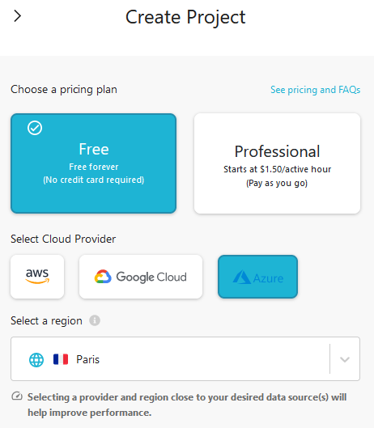
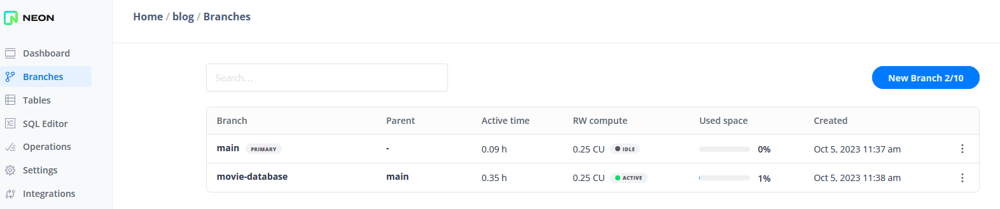

# Overview
We'll be setting up a Hasura Cloud project and configuring the data structure for our movie application. Hasura needs to be connected to a database to function. We'll be using a free Neon PostgreSQL database for this project. We'll be needing a tenant name which will use on multiple occasions. You could pick for example `{name}-movieapp` as your tenant name.

# Setting up Hasura Cloud
Head over to the hasura cloud signup page. Create a new account and login. You'll be greeted by the Hasura Cloud dashboard. From the the dasboard create a new project. 

Rename the project to tenant name you've come up with. Keep this page open whilst you open a new browser tab.

Head over to neon in the new tab, and press sign up. Again using a social login provider or create a new account. In the neon dashboard click on "New Project". Call this project "Learnings". Head over to the branches tab and create a new branch, name it "movie-database".

Open the branch en click on connect. A modal opens with the connection string for your database. Copy the connection string. Now head back to the Hasura console. Click on "Connect Existing Database".

Now head back to the Hasura Cloud dashboard. In your project edit the "Env vars". Click on the button "New Env Var". Insert key name: "PG_DATABASE_URL", and paste the copied connection string in the value field. Click on the "Add" button. Now press the big button "Launch Console".

In the console open the DATA page. Press "Connect Database". At the bottom of the page click on "Conn Exisectting Database". Give it a proper name, "movie-database" for example. And insert the key of the just created environment variable "PG_DATABASE_URL". Click on "Connect Database".

# Setting up PostgresSQL database
https://cloud.hasura.io/signup

https://hasura.io/blog/what-is-hasura-ce3b5c6e80e8/

https://medium.com/geekculture/hasura-in-a-nutshell-2c1cce3b948d#:~:text=Hasura%20is%20a%20backend%20as%20a%20service%20technology,SQL%20database%20readable%20and%20writable%20via%20an%20API.